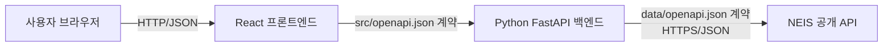

# 급식 배틀 - 학교 급식 조회 앱 기술 요구사항

## 1. 문서 목적

이 문서는 `PRD.md`의 제품 요구사항을 구현하기 위한 기술 구조, 컴포넌트 책임,
인터페이스, 데이터 처리, 실행 환경 및 테스트 전략을 정의한다. 이 단계에서는
설계만 정의하며 애플리케이션 코드는 작성하지 않는다.

## 2. 기술 범위와 원칙

- 프론트엔드는 React와 TypeScript로 구현한다.
- 백엔드는 Python과 FastAPI로 구현한다.
- 브라우저는 백엔드 API만 호출하고 NEIS API를 직접 호출하지 않는다.
- NEIS API 키는 백엔드 환경 변수로만 관리한다.
- 프론트엔드와 백엔드 간 계약은 구현 단계에 `src/openapi.json`으로 정의한다.
- NEIS 외부 API 계약은 `data/openapi.json`을 기준으로 별도 클라이언트에
  구현한다.
- 현재 저장소의 NEIS 명세가 루트 `openapi.json`에 있는 경우 구현 단계에서
  내용의 임의 변경 없이 요구 경로인 `data/openapi.json`을 기준 명세로
  배치한 뒤 사용한다.
- 프론트엔드와 백엔드는 Docker Compose로 함께 빌드하고 실행한다.

## 3. 시스템 아키텍처



### 3.1 데이터 흐름

#### 학교 검색

1. 프론트엔드는 검색어를 검증한 뒤 백엔드 학교 검색 엔드포인트를 호출한다.
2. 백엔드는 검색어를 다시 검증하고 NEIS `schoolInfo` API에 `SCHUL_NM`으로
   전달한다.
3. 백엔드는 NEIS 응답과 `RESULT` 오류 형식을 검증하고 내부 학교 모델로
   정규화한다.
4. 프론트엔드는 학교명, 지역, 학교 유형을 표시하고 사용자가 선택한 교육청
   코드와 학교 코드를 상태로 보관한다.

#### 급식 조회

1. 프론트엔드는 선택한 학교 식별자, 시작일 및 종료일을 백엔드에 전달한다.
2. 백엔드는 식별자와 날짜 범위를 검증한다.
3. 백엔드는 NEIS `mealServiceDietInfo` API를 교육청 코드, 학교 코드,
   시작일, 종료일 및 중식 코드로 호출한다.
4. 백엔드는 외부 응답을 날짜별 내부 급식 모델로 정규화하고 날짜 오름차순으로
   반환한다.
5. 프론트엔드는 정상 결과, 빈 결과 또는 오류 상태를 구분해 표시한다.

## 4. 컴포넌트 책임

### 4.1 프론트엔드

프론트엔드는 표현과 사용자 상호작용을 담당한다.

- 학교 검색어 입력, 검색 실행 및 결과 선택
- 시작일과 종료일 입력 및 기본적인 날짜 범위 검증
- 급식 조회 요청과 로딩·성공·빈 결과·오류 상태 관리
- 날짜별 중식 메뉴 및 부가 정보 표시
- 접근 가능한 레이블, 포커스 이동 및 상태 알림 제공
- `src/openapi.json` 계약에 맞춘 별도 백엔드 API 클라이언트 사용

프론트엔드 코드에는 NEIS 기본 URL, NEIS API 키 또는 NEIS 전용 클라이언트를
포함하지 않는다. `data/openapi.json`의 외부 스키마를 참고해 표시 항목을
이해할 수는 있지만, 런타임 통신은 반드시 백엔드 계약과 클라이언트를 사용한다.

### 4.2 백엔드

백엔드는 외부 API 통합과 애플리케이션 경계를 담당한다.

- 프론트엔드용 학교 검색 및 급식 조회 API 제공
- 검색어, 학교 식별자 및 날짜 범위 검증
- `data/openapi.json`을 기준으로 구현한 별도 NEIS 클라이언트 사용
- 환경 변수의 NEIS API 키를 외부 요청에만 추가
- NEIS의 데이터 응답과 최상위 `RESULT` 응답을 구분해 처리
- 외부 응답을 안정적인 내부 응답 모델로 변환
- 타임아웃, 연결 실패, 잘못된 외부 응답을 의미 있는 백엔드 오류로 변환
- API 키와 민감한 요청 값을 제외한 구조화된 오류 기록

라우트 계층은 HTTP 입력과 출력을, 서비스 계층은 조회 흐름을, NEIS 클라이언트는
외부 통신과 외부 스키마 처리를 각각 담당한다.

## 5. API 계약

구현 단계에서 아래 계약을 `src/openapi.json`에 OpenAPI 형식으로 구체화한다.
경로 및 필드 이름은 해당 문서가 최종 단일 기준이 되며 프론트엔드와 백엔드가
동일하게 사용해야 한다.

### 5.1 학교 검색

`GET /api/schools?query={학교명 일부}`

#### 요청

| 항목 | 형식 | 필수 | 규칙 |
|---|---|---:|---|
| `query` | string | 예 | 앞뒤 공백 제거 후 한 글자 이상 |

#### 성공 응답

```json
{
  "schools": [
    {
      "educationOfficeCode": "교육청 코드",
      "schoolCode": "학교 코드",
      "name": "학교명",
      "region": "지역명",
      "schoolType": "학교 유형"
    }
  ]
}
```

검색 결과가 없으면 HTTP 200과 빈 `schools` 배열을 반환한다. 이는 외부 API
실패와 구분한다.

### 5.2 급식 조회

`GET /api/schools/{schoolCode}/meals`

#### 요청

| 항목 | 위치 | 형식 | 필수 | 규칙 |
|---|---|---|---:|---|
| `schoolCode` | path | string | 예 | 선택한 학교의 행정표준코드 |
| `educationOfficeCode` | query | string | 예 | 선택한 학교의 교육청 코드 |
| `from` | query | `YYYY-MM-DD` | 예 | 조회 시작일 |
| `to` | query | `YYYY-MM-DD` | 예 | 조회 종료일, `from` 이상 |

백엔드는 NEIS 요청 시 날짜를 `YYYYMMDD`로 변환하고 식사 구분
`MMEAL_SC_CODE`를 중식 코드로 고정한다. 클라이언트가 식사 유형을 임의로
변경할 수 있는 입력은 제공하지 않는다.

#### 성공 응답

```json
{
  "school": {
    "educationOfficeCode": "교육청 코드",
    "schoolCode": "학교 코드",
    "name": "학교명"
  },
  "from": "2026-08-01",
  "to": "2026-08-07",
  "meals": [
    {
      "date": "2026-08-03",
      "mealType": "중식",
      "menu": ["메뉴 1", "메뉴 2"],
      "calories": "열량 정보",
      "nutrition": "영양 정보",
      "origin": "원산지 정보",
      "headcount": 100
    }
  ]
}
```

외부 응답에 선택 필드가 없으면 해당 필드는 `null`로 반환한다. 값이 없다는
사실을 빈 문자열이나 임의의 값으로 대체하지 않는다. 메뉴의 알레르기 표기는
삭제하지 않으며, 원본의 줄바꿈 표현은 배열 또는 안전한 텍스트 줄바꿈으로
정규화한다.

### 5.3 상태 코드와 오류 형식

| 상태 | 사용 조건 |
|---:|---|
| 200 | 검색 또는 급식 조회 성공. 결과 없음은 빈 배열로 표현 |
| 400 | 잘못된 검색어, 날짜 형식 또는 날짜 범위 |
| 404 | 요청한 학교 식별자를 확인할 수 없음 |
| 422 | 계약에 맞지 않는 요청 값 |
| 502 | NEIS 오류 응답 또는 유효하지 않은 NEIS 응답 |
| 503 | NEIS 연결 실패 또는 타임아웃 |

오류 응답은 최소한 안정적인 오류 코드와 사용자에게 표시 가능한 메시지를
포함한다.

```json
{
  "error": {
    "code": "INVALID_DATE_RANGE",
    "message": "시작일은 종료일보다 늦을 수 없습니다."
  }
}
```

스택 추적, 내부 URL, API 키 및 NEIS 요청의 민감한 값은 응답에 포함하지 않는다.

## 6. 외부 NEIS 연동

### 6.1 기준 명세와 엔드포인트

`data/openapi.json`의 다음 작업을 사용한다.

| 작업 | NEIS 경로 | 용도 |
|---|---|---|
| `getSchoolInfo` | `/schoolInfo` | `SCHUL_NM` 기반 학교 검색 |
| `getMealServiceDietInfo` | `/mealServiceDietInfo` | 학교 코드와 기간 기반 급식 조회 |

급식 조회에는 `ATPT_OFCDC_SC_CODE`, `SD_SCHUL_CODE`,
`MLSV_FROM_YMD`, `MLSV_TO_YMD` 및 중식용 `MMEAL_SC_CODE`를 전달한다.
응답의 `SCHUL_NM`, `MLSV_YMD`, `DDISH_NM`, `ORPLC_INFO`,
`CAL_INFO`, `NTR_INFO`와 급식 인원수 필드를 내부 모델에 대응시킨다.

### 6.2 클라이언트 규칙

- 응답 형식은 JSON으로 요청한다.
- 연결 및 응답 타임아웃을 명시하고 무한 대기하지 않는다.
- HTTP 상태뿐 아니라 HTTP 200 안에 포함될 수 있는 NEIS `RESULT` 코드도
  검사한다.
- 데이터 없음과 인증·입력·서버 오류를 서로 다른 결과로 처리한다.
- 외부 응답을 경계에서 검증하며 예상하지 못한 구조를 성공으로 처리하지 않는다.
- 페이지 크기를 명시하고 결과가 한 페이지를 넘을 수 있는 학교 검색은 명세의
  전체 건수와 페이지 정보를 사용해 일관되게 처리한다.
- 자동 재시도가 필요하면 연결 실패와 일시적인 서버 오류에 한해 제한된 횟수로
  적용하며 입력 오류는 재시도하지 않는다.

## 7. 상태 및 입력 검증

### 7.1 프론트엔드 상태

학교 검색과 급식 조회는 각각 `idle`, `loading`, `success`, `empty`,
`error` 상태를 구분한다. 새 요청이 시작되면 이전 요청의 늦은 응답이 현재
조건의 결과를 덮어쓰지 않도록 요청 식별 또는 취소 처리를 사용한다.

학교 선택 상태에는 학교명뿐 아니라 교육청 코드와 학교 코드를 함께 보관한다.
검색어 변경만으로 선택을 자동 변경하지 않으며, 다른 학교를 선택하면 이전 급식
결과를 초기화한다.

### 7.2 백엔드 검증

- 검색어는 앞뒤 공백 제거 후 한 글자 이상이어야 한다.
- 학교 및 교육청 코드는 빈 문자열일 수 없다.
- 날짜는 실제 달력에 존재하는 ISO 날짜여야 한다.
- 시작일은 종료일보다 늦을 수 없다.
- 외부 API에 전달할 값은 URL 문자열을 직접 조합하지 않고 HTTP 클라이언트의
  쿼리 매개변수 기능으로 인코딩한다.

## 8. 보안 및 운영 요구사항

- `NEIS_API_KEY`는 백엔드 컨테이너의 환경 변수로 주입한다.
- 실제 키를 이미지, Compose 파일, 소스, 테스트 픽스처 또는 프론트엔드
  번들에 포함하지 않는다.
- 브라우저에 공개되는 프론트엔드 환경 변수에는 API 키를 저장하지 않는다.
- 백엔드는 허용된 프론트엔드 출처만 CORS에 등록하고 운영 환경에서 와일드카드
  출처를 사용하지 않는다.
- 입력값과 외부 오류 전문을 그대로 로그에 남기지 않으며 API 키는 항상
  마스킹한다.
- 컨테이너는 비루트 사용자 실행과 최소 권한을 기본으로 한다.

## 9. Docker Compose 구성

구현 단계의 Compose 구성은 최소 두 서비스를 포함한다.

| 서비스 | 역할 | 요구사항 |
|---|---|---|
| `frontend` | React 정적 자산 제공 및 UI 진입점 | 백엔드의 브라우저 접근 URL만 설정하고 NEIS 키는 전달하지 않음 |
| `backend` | FastAPI 제공 및 NEIS 호출 | `NEIS_API_KEY` 주입, 헬스 체크 제공 |

- 각 서비스는 독립된 Dockerfile로 빌드한다.
- `docker compose up --build` 한 번으로 두 서비스를 빌드하고 실행할 수 있어야
  한다.
- 프론트엔드는 Compose 서비스 이름에 의존하는 브라우저 URL을 직접 사용하지
  않는다. 개발 프록시 또는 외부에 노출된 백엔드 경로를 사용한다.
- `depends_on`만으로 준비 상태를 가정하지 않고 백엔드 헬스 체크를 사용한다.
- 소스 코드 변경용 개발 마운트와 운영 이미지 구성은 분리해 운영 이미지에
  불필요한 파일이 포함되지 않게 한다.

## 10. 테스트 전략

### 10.1 프론트엔드 통합 테스트

프론트엔드는 컴포넌트 단위 테스트를 별도로 확장하지 않고, 사용자 관점의 통합
테스트로 화면과 상태 관리를 검증한다. 네트워크 경계는 백엔드 계약에 맞는
응답으로 대체한다.

- 부분 학교명 입력 후 결과 표시 및 학교 선택
- 검색 결과 없음 표시
- 학교 미선택 상태에서 조회 차단
- 유효한 날짜 범위로 조회 후 날짜별 메뉴 표시
- 누락된 날짜 및 역전된 날짜 범위 검증
- 급식 정보 없음 표시
- 로딩 중 중복 실행 방지
- 백엔드 오류 표시 및 재시도
- 학교 변경 시 이전 급식 결과 초기화

### 10.2 백엔드 단위 테스트

- 검색어 정규화 및 유효성 검사
- 날짜 파싱, 범위 검증 및 NEIS 날짜 형식 변환
- 중식 코드 고정
- NEIS 학교 및 급식 응답의 내부 모델 변환
- 메뉴 줄바꿈과 선택 필드 처리
- NEIS `RESULT` 코드의 데이터 없음·오류 분류
- 외부 오류와 잘못된 응답의 애플리케이션 오류 변환

### 10.3 백엔드 통합 테스트

실제 NEIS 서비스에 의존하지 않도록 외부 HTTP 경계를 모의 서버로 대체하고
백엔드 라우트부터 NEIS 클라이언트까지 함께 검증한다.

- 학교 검색 요청의 쿼리 매개변수와 응답 계약
- 급식 조회의 학교 코드, 기간 및 중식 코드 전달
- 빈 외부 결과의 HTTP 200 및 빈 배열 변환
- NEIS 오류, 타임아웃 및 잘못된 스키마의 상태 코드와 오류 계약
- API 키가 외부 요청에만 포함되고 응답에는 노출되지 않는지 확인

### 10.4 E2E 테스트

Docker Compose와 동일한 서비스 경계를 사용하고 외부 NEIS 응답은 결정 가능한
테스트 대역으로 제어한다.

1. 학교명 일부를 검색한다.
2. 학교를 선택한다.
3. 시작일과 종료일을 선택한다.
4. 조회를 실행한다.
5. 날짜별 중식 결과를 확인한다.

정상 흐름 외에 검색 결과 없음, 잘못된 날짜 범위, 급식 정보 없음의 핵심 예외
흐름도 각각 검증한다. E2E 테스트는 브라우저가 NEIS 엔드포인트를 직접 호출하지
않고 백엔드만 호출하는지 확인한다.

## 11. 계획된 구현 구조

아래는 후속 구현 단계에서 사용할 책임 기준이며, 이 문서 작업에서는 디렉터리나
코드 파일을 생성하지 않는다.

```text
.
├── data/
│   └── openapi.json
├── src/
│   └── openapi.json
├── frontend/
│   ├── src/
│   │   ├── api/
│   │   ├── components/
│   │   └── features/
│   └── tests/
├── backend/
│   ├── src/
│   │   ├── api/
│   │   ├── services/
│   │   └── clients/
│   └── tests/
└── compose.yaml
```

## 12. 완료 기준

- React 프론트엔드와 Python FastAPI 백엔드의 책임이 분리되어 있다.
- 브라우저에서 NEIS로 향하는 직접 요청과 NEIS API 키 노출이 없다.
- NEIS 클라이언트는 `data/openapi.json`, 프론트엔드용 백엔드 클라이언트는
  `src/openapi.json` 계약을 따른다.
- 학교 검색과 중식 조회의 성공, 빈 결과 및 실패가 계약 수준에서 구분된다.
- Docker Compose로 전체 애플리케이션을 빌드하고 실행할 수 있다.
- 프론트엔드 통합 테스트, 백엔드 단위·통합 테스트 및 전체 사용자 흐름의 E2E
  테스트가 통과한다.
